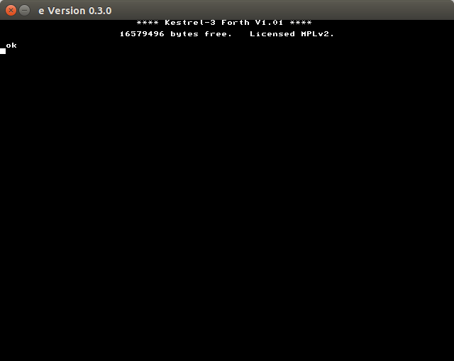

# Introduction

Thank you for your interest in the Kestrel-3 computer.  I built the Kestrel-3 to be completely open-source, from the microprocessor's micro-architecture all the way up to the system software.  What does this mean for you, exactly?  It means that you have the ability to inspect and learn from every component making up the computer and its system software.  It also means that you have the ability to propose changes for future generations of the computer, provided you have the technical skills to implement those changes.  If you *don't* have the technical skills, well, I can't think of a better platform to develop them with.

While I cannot teach you all the tools and skills you'll need in a single, introductory document such as this, I do aim to provide a foundation of knowledge you'll need to be able to use the Kestrel-3 productively, write software for it if you're so inclined, and to have enough background to competently ask for help or alterations to be made to the hardware or system software.

After reading this chapter, you should be able to install and configure the Kestrel-3 emulator.

## Installing the Kestrel-3 Computer Hardware

At the time of this publication, the Kestrel-3 does not exist in physical hardware form.  I will work on this for a future release of the Kestrel project.

## Installing the Kestrel-3 Emulator

The Kestrel-3 computer, like any open source project, will probably never truly be "finished."  The computer, as of this publication, is not suitable for things like watching DVDs or listening to MP3s; however, it is good enough to write simple games and productivity applications.  Besides the elementary machine-language monitor used in early development phases, it now offers a Forth programming language environment.  If you're interested in contributing to the development of the Kestrel-3 software, particularly its emulator, development toolchain, operating system, or even just a nifty Forth program you think others would be interestd in, these instructions should be able to get you on your way to a working environment to play with.

My development platforms include MacOS X El Capitan and Ubuntu Linux 15.04 (64-bit).  I'll now describe how to configure a bare-bones Ubuntu 15.04 distribution to support Kestrel-3 development, which should be sufficient to let you follow along with the examples in the remainder of this book.

### Installing Python

In the Ubuntu Linux environments I've used, it seems to come with Python 2.7 pre-packaged.  Therefore, you need take no further action here.  If, for some reason, your Ubuntu lacks an installation of Python, you can install it with the following command:

    sudo apt-get install python

### Installing GCC

If you haven't done so already on your distribution, you'll need to install the GCC package.  This package provides a C compiler, which is what the emulator is written in.  If you already have GCC installed, it's safe to skip this step.

    sudo apt-get install gcc

### Installing SDL2

To support the emulated VGA display for the Kestrel-3, the emulator needs a graphics library called SDL 2.0.  This library does not typically come installed as a standard package, from what I've seen.  This command will obtain the library and its dependencies.

    sudo apt-get install libsdl2-dev

### Installing Git

We use Git to manage the source code repository for the Kestrel-3 design.  You may skip this step as well if you already have Git installed.

    sudo apt-get install git

### Installing Redo

I chose Redo to provide build automation and dependency analysis.  For my needs, Redo has several advantages over Make:

* The `.do` files describing target rules appear where the target will appear in the filesystem.
* The `.do` files are simple shell scripts, directly executed by the `redo` command(s).

I find this helps keep my build descriptions focused and modular, albeit at the cost of losing the one-stop-shop benefit of having everything in a single Makefile.

    git clone https://github.com/apenwarr/redo
    cd redo
    ./redo
    sudo ./redo install

### Installing GForth

Several of the build tools which helps build the Kestrel-3 system firmware images, such as the Basic Systems Programming Language compiler or the Self-Describing Bus compiler, are written in a dialect of ANSI Forth called GForth.  If you don't already have GForth, you can install it like so:

    sudo apt-get install gforth

**Important!**  Please make sure you receive the 64-bit GForth environment.  The build tools will not currently work with a 32-bit or narrower Forth environment.

### Installing and Building the Kestrel Toolchain

At last, we have what it takes to put everything together and build a Kestrel emulator along with its firmware.

    git clone https://github.com/sam-falvo/kestrel
    cd kestrel/3
    redo

### Verifying Everything Works

You should now be able to invoke the emulator and see reasonable output:

    bin/e romfile roms/forth

This should bring you to the following prompt in your console:

If this message, or a reasonable facsimile thereof, doesn't appear on your computer, something went wrong; try looking for error messages and fixing them, then try again.  If you need further assistance, feel free to open a Github issue at [https://github.com/kestrelcomputer/kestrel/issues](https://github.com/kestrelcomputer/kestrel/issues).

To exit from the emulator, simply close the emulated monitor window.
