# Guided Tour: Writing a Font Editor

In this chapter, we will write a non-trivial, but not overly complicated, application in Forth for the Kestrel-3.  Moreover, unlike many open-source hardware projects, we will do this entirely on the Kestrel-3 itself.  This chapter is not directly intended to teach you how to program the Kestrel-3 *per se*; rather, it's an illustration of what it's like to write software in a native Forth environment.

If you're looking for tutorials on learning Forth in general, you might find the book [Starting Forth, by Leo Brodie](https://www.forth.com/starting-forth/) of particular interest.  The copy I linked to above targets [Forth, Inc.'s SwiftForth](https://www.forth.com/product/swiftforth/); thus, some things will be different for Kestrel-3 Forth, particularly since its foundation, eForth, pre-dates the ANSI Forth standard.

The font editor we describe in this chapter will touch many of the facilities of the Kestrel-3 on different levels of abstraction, and will introduce everything from the most basic to some moderately advanced Forth programming idioms that you might not have seen elsewhere in this book.

The program is presented in a manner that allows you to type in the program step by step and to follow along.  It's perfectly OK if you don't get things the first time around; feel free to revisit this chapter again later.

If you intend on following along, it's best if you insert a *blank* SD card into the Kestrel-3's SD card slot.  This way, you won't have to worry about following the instructions and risking ruining data on an existing SD card.  If you're running the `e` emulator, you can "insert" a card simply by creating a file named `sdcard.sdc` in the same directory that you're running the emulator from.  On Ubuntu Linux, you can do this with the command `touch sdcard.sdc` *before* launching the emulator, like so:

    rm -f sdcard.sdc
    dd if=/dev/zero of=sdcard.sdc bs=1024 count=200
    bin/e romfile roms/forth

## Block Storage vs. Files

After turning on your Kestrel-3, you might be surprised to find that there's no equivalent of a Unix- or Windows-like command-line environment.  You cannot fetch the directory of the SD card, nor can you create or dispose of named files.  That is because these concepts do not exist in Kestrel Forth as of this writing.

With file-based environments, you tend to enter your program using some kind of *editor*, typically as one or more modules, which you then save with a single action (e.g., selecting **Save** from a menu, or typing `SAVE "MY PROGRAM",8` or the like).  Today, even many dialects of Forth prefer this style of programming, since it lets the compiler take advantage of the tooling and filing systems available to the host operating system.  Unfortunately, the Kestrel-3's firmware is currently a minimally viable product: it represents only the smallest subset of a luxurious computing environment.  Despite its limitations, however, you can still get quite a bit of stuff done!

Since the Kestrel-3 currently lacks a file-capable operating system in its system ROM, an alternative method of storing Forth applications is required.  We do this using something called *block storage*.  Blocks are also known as *screens*, particularly when used to store Forth programs.

A single block stores exactly 1024 bytes, or 1 *kilobyte* of memory (in our case, to the mounted SD card).  They are identified by number, from 1 to however many may fit on your particular SD card.  The programmer typically maintains an awareness of which ranges of blocks are used by which programs or which data files.

I'm going to assume you have a fresh SD card inserted into the slot, or an empty `sdcard.sdc` file created for the Kestrel-3 emulator to work with.  To prepare to work on our font editor, let's type the following commands:

    100 CLEAN
    100 LIST

You should see Forth respond with `ok` after it finishes each command.  The first command tells Forth to reset block 100 to all spaces, preparing it to contain Forth source code.  The second lists the block just to make sure it has been cleared.  Your screen should look like this:

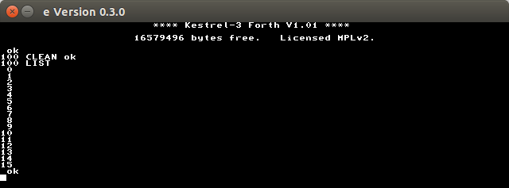

The first and most important block of code we'll write for any application, including the font editor, is what's called the `LOAD` block.  This is the top-level definition of what the program is.  It makes plain the composition of the program in memory.  For particularly large programs, one `LOAD` block might invoke others.  For us, though, we can get away with just one.

Let's provide this block with a title (useful for when we run `INDEX`, used to get a summary of what a range of blocks contain), and a command to load another block.  Do not worry about how I chose this other block; honestly, it's arbitrary.  It also, at this point at least, doesn't matter that we haven't provided any source code for this other block yet, because we'll just `CLEAN` it later first.

    0 SET ( Chapter 2 Font Editor   saf2 2016apr17 )
    2 SET MARKER empty
    3 SET 110 LOAD

Now, if you type `100 LIST` again, you should see the program you entered so far.

## Zooming In on a Glyph

A font is, in its most basic form, a collection of glyphs.  Each glyph describes how the character it represents appears to the human viewer.  The Kestrel's system font consists of 256 fixed, eight-pixel by eight-pixel matrices of on or off bits.

Below, you'll find a blown-up example of what I mean.  It's the letter A itself, represented both in terms of on/off pixels, and the corresponding hexadecimal and decimal representation.

{id="ch2_img_glyphA"}

What we want our font editor to do, ultimately, is render a character in the "fat-bits" matrix, approximating the graph on the left-hand side above, where it's easier for us to see and later manipulate.  We don't really care about the corresponding hexadecimal or even their decimal values.  That's something for the computer to worry about.

### White Fat-Bits

The most fundamental thing we have is "the bit."  It's either on (1) or off (0).  On bits render as white on the screen, so we're going to recreate that in the fat-bits magnification as well.  So, let's write a simple program to render a bit that is "on".  I'm going to zoom in by a factor of 16; meaning, each pixel in a character will now occupy a 16 pixel rectangle on the screen.  Since rectangles aren't fundamental objects, let's break this down even further.

Our rectangle will consist of 16 rows of 16 pixels.  As it happens, Kestrel Forth has a word `H!` which lets us set 16-bits of memory at a time (*half-word store*, in case you were wondering what `H!` stood for).  So, storing a number with all bits turned on into the video frame buffer should yield a small white line in the upper left-hand corner of the screen:

    -1 $FF0000 H!

After demonstrating our intuition is correct, we next want a program to repeat the above simple program enough times to draw a solid rectangle, without having to manually specify addresses everywhere.  Let's just specify the address once:

    PAGE
    $FF0000

and see if we can use the computer itself to remember the address for us.  While we're at it, let's make sure the computer in fact *does* remember our address after we're done:

    -1 OVER H! .S

Why `OVER`?  Because our address was placed on the Forth data stack first, and the value we want to write is underneath it, we need to "reach over" to access the address again for `H!` to work correctly.  The `.S` word will print to the display the current data stack contents without actually clearing the stack.

After proving this does the same thing, we have a number left on the stack -- that's our memory address.  We just need to increment it to the next row of pixels on the screen.  With the Kestrel-3 running at 640x480 resolution with only 2 colors on the screen (black and white), it turns out that each row of pixels corresponds to 80 bytes.  You can figure this out yourself by simply dividing the resolution by the number of pixels stored in a byte (640 / 8 = 80).  So, we use that figure to increment our address:

    -1 OVER H!  80 +  .S

The first time you type the above line, nothing will apparently have happened.  However, as you type that line several times in a row, you should be able to confirm that it actually works as intended.  A slim white rectangle will start to grow downwards in the upper-lefthand corner of the screen.

All that typing is getting laborious though, so let's tell Forth to remember what we mean whenever we say, just to pick an arbitrary name, *row*:

    : row ( a - a' )  -1 OVER H!  80 + ;

There are some more language elements to discuss here.  The `:` symbol tells Forth that we're interested in creating a new word.  The name of the word follows immediately; in this case `row`, as in row of pixels.

The stuff between the parentheses is a *comment*; its purpose is to inform the programmer of some relevant information about the word; it has zero effect on the meaning of the Forth program itself.  In this case, we're illustrating a "stack effect diagram," or more simply, "stack effect."  This is saying to whoever is reading the code, in a symbolic way, that we're accepting an address `a`, and returning another address `a'`.  It's not stated in this comment that `a' > a` or that `a' = a+80`, because it's obvious from context what the result should be.  Reading the line of source, we see that `a'` should be larger than `a` by 80.  Another reason we know this must be true is because of the context in which we intend on using `row`, namely to affect graphics on the screen.  We'll talk more about stack effects elsewhere.

`;` tells the compiler when to *stop* the compilation, and identifies the official end of the definition.

So now, you should be able to just type `row` several times and get the same effect.

When we've convinced ourselves that we can draw individual rows of pixels on the screen, let's bundle this into yet another word that draws a properly proportioned rectangle on the screen, and test it.  Note how we use `PAGE` to clear the screen; it also means we have to use `AT-XY` to place the cursor underneath where we expect the rectangle to go, so the `ok` prompt doesn't overwrite what we just drew.

    : on ( - ) $FF0000 15 FOR row NEXT DROP ; 
    PAGE 0 4 AT-XY
    on

Why only `15` in the program?  That's because `FOR` counts down towards, and including, zero.  If you were to count the numbers out sequentially, 15, 14, 13, 12, 11, 10, 9, 8, 7, 6, 5, 4, 3, 2, 1, and 0, you'll notice that there are in fact *16* numbers present.

You should see a big white rectangle in the upper-lefthand corner of the screen.  This proves to us that the code works as intended; of course, it's fixed to that corner, so we'll need to change this code later.  But, for now, let's commit this to block 110 before we lose it.

    110 CLEAN
    0 SET ( Fat-bits rendering   saf2 2016apr17 )
    2 SET : row ( a - a' ) -1 OVER H! 80 + ;
    3 SET : on ( - ) $FF0000 15 FOR row NEXT DROP ;

To test what we have so far, we make sure that all buffers are actually saved to storage:

    FLUSH

and then we restart the Forth environment:

    BYE

At this point, we should have a clean slate.  Let's make sure our code works:

    100 LOAD
    on
    .S

We should, again, see a white rectangle in the upper-lefthand corner of the screen.  We should also see that our data stack is empty.

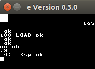

### Black Fat-Bits

We turn our attention now to representing those bits which are turned *off*.  Referring back to [the figure of the glyph for the letter A](#ch2_img_glyphA), note how despite the dark squares imply dark dots on the screen, we can still see the grid lines in the figure.  We similarly want some kind of visual cue on the screen when representing fat-bits for dark pixels.

What we need to do is render the edges of a simple rectangle, like so:

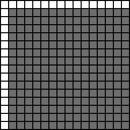

We already know how to get the horizontal line:

    PAGE 0 4 AT-XY
    -1 $FF0000 H!

But, how do we get the vertical strip?  We only need the top-most bit of the 16-bit row to be set, so let's give it a shot:

    $8000 $FF0050 H!

Whoops, that's not right.  If we were to continue with this, we'd end up with something that looks like a giant T.  The reason this happens is because the microprocessor in the Kestrel-3 is a *little-endian* processor, while the video circuitry expects data to be stored in *big-endian* format[^mgia_history].  For this reason, we need to swap the upper and lower halves of the word we want to store.  You can confirm this following code words:

    $0080 $FF0050 H!
    $0080 $FF00A0 H!

You should start to see the top-most portion of the rectangle's edges start to appear in the upper left-hand corner of the screen.

[^mgia_history]: The Monochrome Graphics Interface Adapter, or MGIA, core is responsible for taking data from memory and sending it to your monitor.  I originally developed it for the Kestrel-2, which originally was going to use a *word-addressed* processor.  Later in its evolution, it became more advantageous to switch the processor to use bytes as its smallest addressible unit; however, the MGIA remained word-addressed.  The Kestrel-3 inherits the Kestrel-2's MGIA (in the upgraded form of the MGIA-II) core, complete with its word-based addressing.  Fear not, however; the successor to the MGIA-II core will let you adjust its endianness, making writing software for it significantly less burdensome.
 
So, our black fat-bit consists of a row of pixels, followed by a 15-tall column of pixels.  Let's incorporate that definition into our program so far:

    110 LIST
    3 OPEN
    3 SET : col ( a - a' ) $0080 OVER H! 80 + ;
    5 SET : off ( - ) $FF0000 row 14 FOR col NEXT DROP ;
    FLUSH
    100 LOAD
    off .S

The `OPEN` command is used to insert a blank line at the indicated line.  This lets us use `3 SET` subsequently to insert code before the definition of `on` (which is now on line 4).  Be careful when using `OPEN` though; anything stored on line 15 will be discarded.  Thankfully, we're no where close to having to deal with that problem.

Note also that we define `col` above the definition of `on` or `off`.  In this simple example, it's not strictly necessary to do this, so long as you make sure `col` appears before `off`.  However, I find it useful to organize words by their logical relationship to each other.  In this case, `row` and `col` are related in that they're primitives used by `on` and `off`.

Anyway, you should see something like the following:

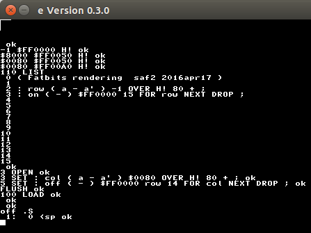

### Rows of Fat-Bits

At this point, we have a means of drawing a single white or black fat-bit in the upper left-hand corner of the display.  But, what we'd really like is to draw a complete matrix of them.  A matrix is an array of arrays, of course, so it seems logical that our next step is to simply get an array of fat-bits up on the screen first.

I need a plan to go about doing this.  I won't go into the different approaches I've considered here; this chapter is already quite long as it is.  Instead, I'll just invoke the power of successive refinement and iterative programming.

For the moment, let's pretend we have a version of `on` and `off` which renders a white or black fat-bit where we tell it.  That is, instead of hardcoding `$FF0000` as the frame buffer memory address, we accept this value from the stack.  It would be very convenient if we can invoke a sequence like, `on off on off`, to just render fat-bits horizontally.  Since `on` and `off` would accept an address from the stack, it follows that they *must* also leave an address on the stack as well.

In other words, we need `on` and `off` to have the following stack effects:

    : on ( a - a' ) ...
    : off ( a - a' ) ...

But what is `a'` in this case?  Since a byte holds 8 pixels, and our fat-bits are 16-pixels wide, it follows then that `a' = a + 2`.  Provided we don't do this more than 40 times in a row, we should be able to draw a horizontal strip of fat-bits.

The simplest way to achieve this is to change our existing definitions like so:

    110 LIST
    4 SET : on ( a - a') DUP 15 FOR row NEXT DROP 2 + ;
    5 SET : off ( a - a') DUP row 14 FOR col NEXT DROP 2 + ;
    110 LIST  ( to make sure our changes took )
    FLUSH

Now, we need to test them to make sure our assumptions hold.

    BYE
    100 LOAD
    $FF0000 on off on off HEX U. DECIMAL

You should see something like the following:

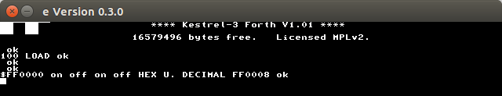

Notice that the address left on the stack is 8 greater than what we started with, which is what we'd expect after incrementing it by two four times.  Further note the on/off pattern on the top of the display.

But, calling `on` and `off` manually isn't the goal; we want to invoke them in a pattern based on the numbers corresponding to a row in a glyph's font.  The top of the letter A, [if you'll recall](#ch2_img_glyphA), is represented by the number `24`.  How can we convert a number into a set of fat-bits?  Let's make a word which handles this one bit at a time.  Literally.

    : pixel ( n a - n' a' ) OVER $80 AND IF on ELSE off THEN SWAP 2* SWAP ;
    PAGE 0 4 AT-XY
    24 $FF0000
    pixel
    pixel
    pixel
    pixel
    pixel
    pixel
    pixel
    pixel

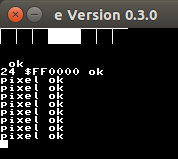

Success!  Now we commit this to our program in block memory.

    110 LIST
    7 SET : pixel ( n a - n' a' ) OVER $80 AND IF on ELSE off THEN
    8 SET     SWAP 2* SWAP ;
    9 SET : row ( n a - ) 7 FOR pixel NEXT 2DROP ;
    FLUSH

Whoa, hold up!  I'm redefining `row` on line 9.  How is this supposed to work?  Forth, unlike other programming languages, has what's called a *hyper-static global environment.*  These four fancy words basically means, very simply, if you *redefine* a word, then *prior* uses of the word *do not* change meaning.  Only future uses of the word take on the new semantics.

**This is why you hear the word *context* so frequently in Forth programming.**  It's clear that, by the time line 9 rolls around, the *context* for what a row of pixels *means* has changed.  We simply make this known to Forth in the most natural way possible; we simply *redefine* it as we need it, *when* we need it.

Contrast this with virtually any other language you're likely to come into contact with.  Particularly illustrated by, just to pick one, Javascript, if you were to change the meaning of `row` like this (in some made-up dialect of Lisp):

    function row() {
      console.log("Row 1 called.");
    };

    function box() {
      for(i = 0; i < 16; i++) {
        row();
      };
    };

    function row() {
      console.log("Row 2 called.");
    };

then the meaning of `box()` would fundamentally change (instead of printing sixteen `Row 1 called.` messages, it now prints `Row 2 called.` messages instead).  Were you to do this in a more rigorous compiled language like C, you'll just get a compile-time error for duplicately defined symbols.

In either case, you're *forced* to name everything uniquely, even disposable concepts.  With Forth, you are not compelled to do so.

Anyway, we can prove that this works easily enough:

    BYE
    100 LOAD
    24 $FF0000 row .S

Note that we use `2DROP` to clean the stack up after we're done rendering the row.  Cleaning up after ourselves is important because it lets us think about words that perform an action (a "procedure") strictly as *verbs*; once they're proven to work, we can treat them axiomatically when debugging more complex programs later.

Now that we can render a row, we need to use `row` to build out our matrix on the screen.  We want each row to appear 16 pixels below its predecessor.  Since each row of pixels requires 80 bytes of frame buffer memory, that corresponds to 1280 bytes.  So, let's make a new word `matrix` to render the complete matrix.

    : matrix ( b a - ) 7 FOR OVER C@ OVER row 1280 + SWAP 1+ SWAP NEXT 2DROP ;

**Note.** I'm no longer taking byte values directly from the stack; now, `b` refers to a byte in memory (`C@` means *character fetch*).  Yes, Kestrel Forth is a 64-bit Forth, which means we can pass 8 bytes directly in if we wanted to.  However, it's more useful to draw data from memory, which we'll see in a later section.

We can test this simply enough by copying the bytes from [the glyph for A](#ch2_img_glyphA) into a 64-bit wide variable, and sending it through `matrix` like so:

    VARIABLE bm ( bit map )
    $183C3C667EC3C300 bm !
    PAGE 0 17 AT-XY
    bm $FF0000 matrix

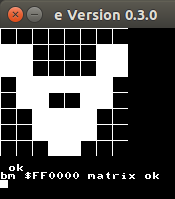

Whoops; I forgot to swap the bytes due to the MGIA's big-endian accesses to memory.  Even so, I think we've adequately proven that `matrix` works as intended.  Let's commit it to block storage now.

    110 LIST
    10 SET : matrix ( b a - ) 7 FOR OVER C@ OVER row
    11 SET     1280 + SWAP 1+ SWAP NEXT 2DROP ;
    FLUSH
    110 LIST

This block is starting to look pretty full, so I think we'll end it there.  Really, the whole purpose of this block is to render the matrix, so let's update the index title accordingly.

    0 SET ( Fat-bits: matrix   saf2 2016apr17 )
    FLUSH
    110 LIST

One final test to make sure it works from a clean slate:

    BYE
    100 LOAD
    VARIABLE bm
    $00C3C37E663C3C18 bm !
    bm $FF0000 matrix

We should see a giant version of the letter A.

Since we've accomplished one of our goals, now seems like a good time to update documentation for our software.  I'm going to place our documentation in block 111.

    111 CLEAN
    0 SET \ shadow docs: matrix    saf2 2016apr17
    2 SET row (a - a') draws 16 white pixels at the screen addr
    3 SET     passed in.  Returns the next addr in the column.
    4 SET col (a - a') draws a single pixel, but otherwise
    5 SET     similar to row.
    6 SET on, off (a - a') draws a white or black fat-bit resp.
    7 SET pixel (n a - n' a') draws a single pixel, taken from
    8 SET     bit 7 of n.  a' points to next fat-bit, n' is 2*n.
    9 SET row (n a -) draws a single row of fat-bits, based
    10 SET     on the value of n.
    11 SET matrix (b a -) draws an 8x8 grid of fat-bits. Data
    12 SET     comes from a buffer pointed at by b.
    FLUSH

These kinds of screens are historically known as *shadow blocks*.  They contain synopses which explain the roles of the words defined in the corresponding non-shadow block.  By convention, even-numbered blocks contains code, and odd-numbered blocks contains commentary.  It's a good habit to write shadow comments once a block of code has been composed.  Forth is extremely terse, and it's much easier to forget the purpose of a word sooner than in other, more conventional programming languages.

## Your Move: Prompting the User with a Cursor

We've gotten a reasonable facsimile of the graph to show on the screen.  But, now, let's add a *cursor* so that we can indicate which cell on the fat-bit grid to change.

OK, more specifications.  There are several approaches we can take to accomplish this goal, but once again, I'm going to compact my thought process down for the sake of shortening an already lengthy chapter.

I think it'd be nice to have a small, grey dot in the middle of a cell to indicate the current cell.  Of course, as I write this, the Kestrel-3 does not have greyscale capability, so we'll emulate it with a simple dither pattern, like so:

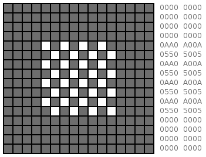

I like this design, because it leaves a large portion of the cell visible to the user, while still providing a visual cue to the user which cell is currently referenced by the program.  Other options include cross-hairs, an arrow shape, etc.

I've also converted the bitmap pattern into hexadecimal values both for human consumption (middle column), and in the proper format expected by the MGIA hardware (right-most column).  We'll be using the latter column later.

### Rendering the Cursor

For now, let's keep things simple, and just render the cursor on the screen in the upper left-hand corner.  We can expand from there later.

First, we start out with defining our bitmap data.

    CREATE cursorImg
    0 , 0 , 0 , 0 , $A00A , $5005 , $A00A , $5005 ,
    $A00A , $5005 , $A00A , $5005 , 0 , 0 , 0 , 0 ,

Next, I'll make a word that "paints" the cursor, line by line, just like we did with a fat-bit.  We know in this case that it must accept two addressses (one for our cursor image, and one for the framebuffer), and it should leave two addresses on the stack (same thing, suitably adjusted) so we can just run the same word again and again until the cursor has been rendered.

Unlike painting the fat-bits, though, we want each on-bit in our cursor image to *toggle* the on-screen bit on or off.  Off bits should cause no action to take place.  It turns out there's a logical operator called *exclusive-OR* (`XOR`) which does this for us.  As you might imagine, `H@` is the compliment to `H!`, where it reads a 16-bit quantity from memory (*half-word fetch*).

    : row ( c a - c' a' ) OVER @ OVER H@ XOR OVER H! 80 + SWAP CELL+ SWAP ;

We can test it out like so:

    PAGE 0 17 AT-XY
    cursorImg $FF0000
    row row row row
    row row row row
    row row row row
    row row row row

At this point, we should have a small grey dot in the upper lefthand corner of the screen.

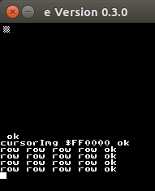

We see that it works, so let's commit this to block storage for future use.

    108 CLEAN
    0 SET ( Cursor Display    saf2 2016apr19)
    2 SET CREATE cursorImg HEX
    3 SET   0000 , 0000 , 0000 , 0000 , A00A , 5005 , A00A , 5005 ,
    4 SET   A00A , 5005 , A00A , 5005 , 0000 , 0000 , 0000 , 0000 ,
    5 SET DECIMAL
    7 SET : row ( c a - c' a' ) OVER @ OVER H@ XOR OVER H!
    8 SET     80 + SWAP CELL+ SWAP ;
    FLUSH

We can make sure everything still works by testing the program so far:

    BYE
    PAGE 0 17 AT-XY
    108 LOAD
    cursorImg $FF0000
    row row row row
    row row row row
    row row row row

That should work well enough to render the cursor onto the sreen.  If so, let's link it into our font editor program.

    100 LIST
    3 SET 110 LOAD ( matrix visuals )
    4 SET 108 LOAD ( cursor visuals )

### Moving the Cursor

The cursor doesn't serve much purpose if it's just stuck in one spot on the screen; there needs to be a way to actually move it around.  So, our next step is to adjust the code we've written so far so that we can place it anywhere on our matrix.

We know the fat-bit matrix is 8 wide and 8 tall, so it seems reasonable that we should make some kind of mathematical formula that translates a pair of small integers into a screen address.  `cursor` already accepts a screen address, so there is no need to change `cursor` itself.

We know that each cell is two bytes wide, so it seems reasonable that we multiply `x` by two and add to some base address.  Let's write that first, since that should be pretty simple to get working.

    : addr ( x - a ) 2* $FF0000 + ;

Well, that was pretty easy.  Let's test it.

    HEX
    0 addr U.
    1 addr U.
    2 addr U.
    7 addr U.
    DECIMAL

The first three prints establish the pattern we want to see; with each increasing coordinate, the resulting address goes up by two.  The final test is just for good measure.

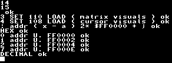

**Preconditions again.**  We will *never* invoke this function with a `x` coordinate outside the range of 0 to 7.  So, we do not include any explicit error-checking logic here.  In most other programming languages, the very *thought* of coding like this would be anathema.  If you feel safer adding this bounds-checking logic, I'll leave it as an exercise for you to consider.  However, just be aware: our *intention* that `addr` be invoked with an `x` coordinate in the range 0..7 will be documented in the shadow block later, but it will be *enforced* in the *code* elsewhere.  I can get away with this because `addr` is very clearly a function that is of domain-specific, very limited use outside of the font editor.

**If**, however, I were writing a word for general purpose consumption, where I simply *didn't trust* the code invoking my software, then things would be very different.  I would never trust my inputs, and would strongly encourage bounds checking in this case.  However, this is a topic for another time, and is well beyond the scope of this chapter.

Let's try rendering the cursor in the 3rd place over to the right, just to get a feel of how everything is supposed to fit together:

    PAGE 0 17 AT-XY
    cursorImg 3 addr
    row row row row
    row row row row
    row row row row

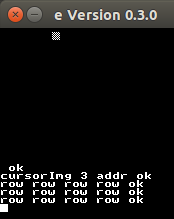

It's now time to consider the `y` coordinate, or the vertical axis.  Like the horizontal axis, we are going to constrain it to the values 0 to 7 inclusive elsewhere in the code.  But, our address computation is different.  Each fat-bit cell is 16 pixels tall, and as we recall from before, each row on the screen consists of 80 bytes.  So, each row of the fat-bit matrix consists of 1280 bytes of memory.  So, let's account for that in our definition of `addr` now:

    : addr ( x y - a ) 1280 * SWAP 2* + $FF0000 + ;

As you can see, the effective address computation is a bit more complex, but not terribly so.  We first account for the `y` coordinate, then tackle the `x` coordinate separately and add them together.  Once we have our relative offset, we add the base address of the screen, and that's our final address for the cursor.  Let's test it.

    PAGE 0 17 AT-XY
    cursorImg 3 4 addr
    row row row row
    row row row row
    row row row row

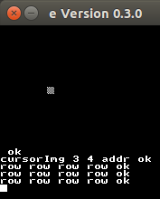

We see that things work, so let's commit this to block storage.

    108 LIST
    10 SET : addr ( x y - a ) 1280 * SWAP 2* + $FF0000 + ;
    FLUSH

You can probably predict how we're going to write a word that draws the entire 16x16 pixel image for the cursor.  Here's how I did it, and tested it.

    : cursor ( x y - ) cursorImg -ROT addr 15 FOR row NEXT 2DROP ;
    PAGE 0 17 AT-XY
    2 4 cursor 7 5 cursor .S

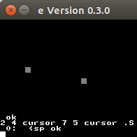

Now that we have this code working, we can commit this as well.

    108 LIST
    12 SET : cursor ( x y - ) cursorImg -ROT addr
    13 SET     15 FOR row NEXT 2DROP ;
    FLUSH

Looks like we have completed our cursor drawing program, so now it's time to update our documentation.

    109 CLEAN
    0 SET \ shadow docs: Cursor rendering
    2 SET cursorImg (-a) answers the address of a 16x16 pixel bit-
    3 SET     map containing the cursor image.
    4 SET row (c a-c' a') toggles bits in the on-screen frame-
    5 SET     buffer if and only if corresponding bits in the
    6 SET     cursor bitmap are set.  Adjusts pointers.
    7 SET addr (x y-a) answers the framebuffer address correspond-
    8 SET     ing to the specified coordinate in the fat-bit
    9 SET     matrix.
    10 SET cursor (x y-) draws or undraws (if called again) the
    11 SET     cursor image at the designated place on the fat-
    12 SET     bit matrix.
    FLUSH

### Making Sure It All Works Together

A final test is to make sure that our fat-bits matrix code and our cursor rendering code actually works together.  There's no obvious reason why they should interfere; however, computer software has a nasty habit of surprising the author in this respect.

We'd like to create a simple glyph buffer, display it, and present the cursor in its home position (0,0).  That should be enough for now.

    BYE
    100 LOAD
    VARIABLE glyph
    $1122334455667788 glyph !
    PAGE 0 17 AT-XY  glyph $FF0000 matrix  0 0 cursor

The result should look somewhat like this:

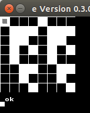

Once we know that it does, let's commit it to block storage.

    106 CLEAN
    0 SET ( full screen update    saf2 2016apr22 )
    2 SET VARIABLE glyph
    3 SET $1122334455667788 glyph !
    4 SET : everything ( - ) PAGE glyph $FF0000 matrix 0 0 cursor ;
    FLUSH

    100 LIST
    5 SET 106 LOAD ( full screen visualization )
    FLUSH

We should now be able to test that it integrates nicely:

    BYE
    100 LOAD everything

After a few seconds, the screen should look like before, with a simple fat-bits matrix and a cursor in position (0,0).  The only difference is the `OK` prompt will partially overwrite the results.

When we're happy with that, let's not forget to update our shadow documentation.

    107 CLEAN
    0 SET \ shadow docs: full screen update
    2 SET glyph (-a) is a 64-bit buffer holds the current image of the
    3 SET   glyph being edited.
    4 SET everything (-) redraws the entire screen from scratch.  This
    5 SET   is a very slow operation since it touches every pixel on
    6 SET   the screen, so use with care.
    FLUSH

## Quitting the Application

Let's switch gears for a moment.  So far, we've been writing code to provide visual output to the user.  However, we also need to accept input as well.  We know we want the font editor to run as an application; however, we need a way to exit the editor so that the user can return to a normal Forth `ok` prompt whenever he or she wants.  I'm going to pick an arbitrary convention for this now.  We can implement this logic simply enough by waiting for a key press of the letter `Q`, like this:

    BYE
    : quit? ( c - f ) 81 = ;
    : main ( - ) BEGIN KEY quit? UNTIL ;

We can test this now like so:

    main

The computer should appear to lock up, doing absolutely nothing what-so-ever until you type a capital `Q` on the keyboard.

Once we've confirmed this works as expected, let's bundle it into the rest of our application as well.

    100 LIST
    6 SET 104 LOAD ( main event loop )
    104 CLEAN
    0 SET ( main event loop   saf2 2016apr22 )
    2 SET : quit? ( c - f ) 81 = ;
    3 SET : main ( - ) BEGIN KEY quit? UNTIL ;
    FLUSH

And once more, a simple integration test.

    BYE
    100 LOAD
    main .S

You should be able to mash on the keyboard all you want; it should not return to an `ok` prompt until you type a capital `Q`.  Furthermore, the data stack should report as empty.

Normally, we'd end up writing a shadow block now; from now on, I'm going to skip doing this for brevity's sake.  This chapter is alreay quite long as it is!

## Where Do We Begin?

Now that we have a way of *quitting* the application, how do we *start* it?  Perhaps a more important question, with which glyph do we begin our editing session with?  So far, on block 106, we maintain a single 8-byte buffer (one variable in Kestrel-3 Forth happens to be eight bytes) to hold our glyph's image in.  We even pre-initialize it with some bogus data just to confirm our visualization code continues to work.  However, we've reached a point now where this is no longer feasible.

At this point, I need to talk more about how Kestrel-3 Forth interprets font data in memory.  A font always contains 256 glyphs, whether they're used or not.  Each glyph consists of eight bytes of data.  So, a complete font contains 256 \* 8 = 2048 bytes of memory.  We need to allocate at least this much space as a temporary working font for the font editor to work from.  This buffer will replace the `glyph` variable.

Next, we need to adjust how each row of pixels is accessed.  This will involve changing code in block 110.  This is because the Kestrel-3 treats fonts as a single **2048x8** pixel bitmap, instead of as a sequential array of 8x8 bitmaps.  See the following figure to see how these are different.

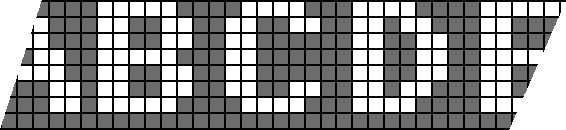

The changes are relatively simple, but we must remember to make them.  So, instead of each row of pixels being at sequential addresses, they now appear at 256-byte offsets from each other.

Finally, we need to provide a communications path from the user to the font editor that lets the user select which glyph to edit when starting the font editor.  We'll re-purpose the variable `glyph` for this purpose.

Unfortunately, these changes are not something which can be easily tested interactively.  So, in the event of a defect being introduced, we'll need to rely on some debugging skills or simple logic to figure things out.  However, it's always best to get into the habit of proving the correctness of your code ahead of time as much as you can.  It will take longer to write your programs this way, but it will save immense amounts of time when debugging later.

Let's begin with creating the 2KiB buffer we'll use for temporary storage.

    0 SET ( full screen update    saf2 2016apr22 )
    2 SET VARIABLE glyph
    3 SET $1122334455667788 glyph !
    4 SET : everything ( - ) PAGE glyph $FF0000 matrix 0 0 cursor ;

    106 LIST
    3 SET CREATE fontbuf  2048 ALLOT

Next, we're going to alter our `everything` definition to compute the proper glyph address inside this bitmap.

    4 OPEN
    4 SET : addr ( c - a ) fontbuf + ;
    5 SET : everything ( - ) PAGE glyph @ addr $FF0000 matrix
    6 SET     0 0 cursor ;

That should be all we need to get the fat-bit code to start drawing the matrix.  Getting it to *continue* drawing the right bits in the matrix is the next thing we need to change.

    110 LIST
    11 SET     1280 + SWAP 256 + SWAP NEXT 2DROP ;

Finally we need to provide a way of "running" the font editor with the provided glyph number.  We'll just set the lowest 8-bits of the glyph and invoke `everything` then `main`.

    104 LIST
    5 SET : design ( n - ) 255 AND glyph ! everything main ;

We should now be in a position to test everything.

    FLUSH
    BYE
    100 LOAD
    2 design

We should finally have a program that draws a fat-bit matrix and a cursor, but which does nothing until you press capital `Q`.

## Going Mobile -- Supporting Cursor Movement

Right now, our font editor's utility remains quite limited.  No means exists for moving the cursor about the glyph.  I will add the ability to move the cursor in this section.

Instead of relying on SDL- or PS/2-specific keycodes for the arrow keys found on most keyboards, I'm going to stick with using plain ASCII.  For now, let's use `W`, `S`, `A`, and `D` keys for up, down, left, and right movement.  Implementing cursor movement will involve changing three blocks of code.  First, we need to add the lower-level words that actually perform the visual bookkeeping.  Next, we need to enhance the `main` event handler to support more than just quitting the application.  Finally, we need to provide appropriate bindings between the event handler and our lower-level words.  We'll treat the event dispatcher changes in the next section.

We start by implementing the low-level code.  We must recognize that the first-generation Kestrel-3 computer is not a fast computer; we cannot just refresh the entire display and expect good performance.  Instead, it would be better if we rendered the full display, and then *incrementally* updated the display with each input event.  To see how this works, we first render the entire display:

    cursor- everything 0 17 AT-XY cursor+

The words `cursor-` and `cursor+` hide and reveal the text cursor, respectively.  Without these words, cursor-shaped video artifacts will remain, as the Forth interpreter and our application will compete for access to the same pixels.  Your screen should look like this:

Notice that the cursor appears at location (0,0) in the matrix.  If we want to move it to location (1,0), for instance, we first must erase the cursor at (0,0), then redraw it at (1,0).

    0 0 cursor  1 0 cursor

The screen should now look like:

Thus, every cursor movement key must first erase the cursor from where it's currently located, then adjust the coordinates, then redraw.

    VARIABLE cx  VARIABLE cy
    0 cx !  0 cy !
    : toggle ( - ) cx @ cy @ cursor ;
    : goL ( - ) toggle  cx @ IF -1 cx +! THEN  toggle ;
    : goR ( - ) toggle  cx @ 7 < IF 1 cx +! THEN toggle ;

To test what we have so far, let's refresh the display, and try moving the cursor to the right (`goR`) or to the left (`goL`).

    cursor- everything 0 17 AT-XY cursor+
    goR goR goR ( move to the right 3 places )
    goL goL goL ( move back )
    goL goL ( try to go beyond left-hand edge )
    toggle 7 cx ! toggle
    goR goR ( try to go beyond right-hand edge )
    goL

After confirming the above logic works, we now gain the confidence to do the same with the Y coordinate as well.

    : goU ( - ) toggle  cy @ IF -1 cy +! THEN  toggle ;
    : goD ( - ) toggle  cy @ 7 < IF 1 cy +! THEN  toggle ;
    0 cx ! 0 cy !
    cursor- everything 0 17 AT-XY cursor+
    goD goD goD ( move down 3 places )
    goU goU goU ( move back up )
    goU goU ( try to go beyond top edge )
    toggle 7 cy ! toggle
    goD goD ( try to go beyond bottom edge )
    goU

Since the logic is so similar to the horizontal movement words, it should be a fairly rote procedure to confirm that the vertical movement words work as intended.  Once this is done, we commit them to block storage.

    106 LIST
    5 SET VARIABLE cx  VARIABLE cy  VARIABLE glyph
    8 SET     home toggle ;
    7 OPEN
    7 SET : home ( - ) 0 cx ! 0 cy ! ;
    7 OPEN
    7 SET : toggle ( - ) cx @ cy @ cursor ;

    112 CLEAN
    0 SET ( cursor movement   saf2 2016apr22 )
    2 SET : goL ( - ) toggle  cx @ IF -1 cx +! THEN  toggle ;
    3 SET : goR ( - ) toggle  cx @ 7 XOR IF 1 cx +! THEN  toggle ;
    4 SET : goU ( - ) toggle  cy @ IF -1 cy +! THEN  toggle ;
    5 SET : goD ( - ) toggle  cy @ 7 XOR IF 1 cy +! THEN  toggle ;

    100 LIST
    7 SET 112 LOAD ( cursor movement )

    FLUSH

Now we test our integration.

    BYE
    100 LOAD
    cursor- everything 0 17 AT-XY cursor+ home
    goR goR
    goD goD
    goL goL
    goU goU

Everything should look pretty good at this point, which now frees us up to going back to consider how we handle event dispatch.

### Revisiting the Main Loop

In this section, we need to implement an event dispatching mechanism that is somewhat more sophisticated than simply checking to see if we're quitting or not.  My strategy for this is to convert key presses into Forth dictionary lookups.  This maps each key (say `Q`) to a specially formatted Forth word (e.g., `$$Q`).  If the word is discovered, it's executed; otherwise, we just ignore the key press.

First, let's test our intuition about finding a word in the dictionary.  We need a workspace to construct words with:

    VARIABLE ws
    $20242403 ws !

This lays down four bytes into the variable, which form a valid Forth string.  In fact, we should be able to `TYPE` it and get back the following result:

    ws COUNT TYPE CR

Let's define a simple word according to this template:

    : $$A ." Hello world" CR ;

We should be able to locate this word by name:

    : test1 $" $$A" NAME? .S ;
    test1

We should have two values on the stack; their meaning isn't important now, except for the fact that they should both be non-zero.  This is how we know the word was found.  If we try to find a word which we know hasn't yet been defined, we expect the top item on the stack to be zero.

    : test2 $" $$B" NAME? .S ;
    2DROP test2

Locating the word based on a key press should now be fairly obvious.  We simply store the keycode into the appropriate place in the `ws` workspace, and then pass it to `NAME?` to find the word.

    : handler ( c -- xt na | ws 0 ) ws 3 + C! ws NAME? ;
    KEY handler .S

If you type a capital-`A`, you should see that the word is found (non-zero top of stack).  If you press `B`, or some other character, you should find the top of stack zero.

Now that we see how this all works, let's alter our event handling code to make use of the new dispatching logic.  We're just going to rewrite the whole block from scratch, since that takes less effort than incrementally changing things.

    104 CLEAN
    0 SET ( main event loop   saf2 2016apr22 )
    2 SET VARIABLE done?   VARIABLE ws
    3 SET : handler ( c - xt na | ws 0 ) ws 3 + C!  ws NAME? ;
    4 SET : main ( - ) BEGIN KEY handler IF EXECUTE ELSE DROP THEN
    5 SET     done? @ UNTIL ;
    7 SET : design ( n - ) 255 AND glyph !  everything
    8 SET     0 done? !  $20242403 ws !  main ;
    10 SET : $$Q ( - ) -1 done? ! ;
    FLUSH

Now we can test to see if the new event handler works exactly like the old one.

    BYE
    100 LOAD
    2 design

You should see the fat-bit matrix and the cursor again, and it should not do anything with any key you type *except* for capital `Q`, which should exit the program.

Now that we have this logic implemented, we can now easily express our keyboard mappings for basic cursor movement.

    114 CLEAN
    0 SET ( keyboard mappings   saf2 2016apr23 )
    2 SET : $$w ( - ) goU ;
    3 SET : $$s ( - ) goD ;
    4 SET : $$a ( - ) goL ;
    5 SET : $$d ( - ) goR ;
    7 SET : $$i ( - ) goU ;
    8 SET : $$k ( - ) goD ;
    9 SET : $$j ( - ) goL ;
    10 SET : $$l ( - ) goR ;

    100 LIST
    8 SET 114 LOAD ( keyboard mappings )

I'm kind of showing off here; I'm mapping `WASD` and `IJKL` to the same cursor movement functions to facilitate left- and right-handed keyboard navigation.  Go ahead and try it out:

    FLUSH
    BYE
    100 LOAD
    2 design

Feel free to play around with the keyboard navigation keys.  Screen update should be quick and snappy.  Press `Q` (capital!) to quit back to Forth.  

## Toggling Bits

Ideally, I'd like to use the spacebar to toggle bits in a glyph.  But, this poses a bit of a problem with our current event dispatcher.  The space is what Forth uses to separate words; ergo, it cannot appear *in* a word.  Several approaches exist to remedy this: we could change our `handler` word to use hexadecimal ASCII codes in the words it looks up instead of the actual characters themselves, or we can add custom logic to detect spaces and dispatch accordingly.

The former approach requires changing a greater number of lines of code: everything in block 114, and a few in block 104, and whatever is new for dispatching on the space (I figure, two lines of code).  That's less than 32 lines of code for sure; however, I think I can do it in only 4 to 5 lines of code if I just dispatch on the space explicitly.  For this reason, I choose the latter approach.

    104 LIST
    3 OPEN
    3 SET : -space ( c - c' ) DUP $20 = IF DROP 95 THEN ;
    5 SET : main ( - ) BEGIN KEY -space handler IF EXECUTE ELSE DROP THEN

    114 LIST
    11 SET : $$_ ( - ) 0 17 AT-XY ." Hello world!" CR ;
    FLUSH
    BYE
    100 LOAD
    0 design

At this point, confirm that the cursor keys still work.  Then, press the spacebar.  You should get a worldly greeting!

Now that we have the spacebar functionality activated, let's make it do something useful.  We know that we want to *toggle* a bit, which just screams for using `XOR` again, just like we did when drawing and erasing the cursor.  Thus, if we're given a memory address for a byte in a glyph, we can affect one of its bits like so:

    : flip ( a m - ) OVER C@ XOR SWAP C! ;

We need to compute both the `m` mask and the `a` address; but, for now, we can test that this works by using our framebuffer to directly inspect bits.

    PAGE 0 17 AT-XY
    $FF0000 1 flip
    $FF0000 1 flip

After executing first `flip` call, you should see a white pixel appear in the upper left-hand corner of the display.  After the second, it should disappear.

Next, I'm going to tackle the mask.  We know the cursor location is stored in the variables `cx` and `cy`; `cy` selects which byte in the glyph we want to affect, while `cx` determines which bit.  Note the mapping for bits is backwards from what most other software (and even the processor itself) expects.  See figure for an illustration of what I mean.

Generating the value for `m`, then, involves shifting the value `1` left by 7 positions if `cx` is 0, 6 if it's 1, etc.  In other words:

    : mask ( x - m ) 1 SWAP 7 XOR LSHIFT ;

    7 mask .
    6 mask .
    1 mask .
    0 mask .

should yield the values 1, 2, 64, and 128, respectively.

Calculating the address of the byte is similar to computing the address of a byte in the screen's frame buffer.  A single increment of `cy` implies a 256-byte span, so the byte we're interested in working with is *a* + 256\*`cy`, where *a* represents the *base address* of the glyph (byte 0 of the glyph).  Thankfully, *a* is easily computed as the sum of `fontbuf` (the pointer to the first byte of the first glyph) and the selected character.

    : addr ( g y - ) 256 * + fontbuf + ;

Putting everything together, we get the following procedure to change a bit:

    : change ( - ) glyph @ cy @ addr cx @ mask flip ;

We're going to have to trust this definition for the time being.  Since it depends on the values of `cx`, `cy`, `fontbuf`, and whatever contents are inside of `fontbuf`'s 2KB allotment, making a convenient, interactive test for this word is more difficult.  However, we've proven that `addr`, `mask`, and `flip` work independently, so through inductive reasoning, I'm going to say that `change` will work as well.

Let's commit this to block storage:

    112 LIST
    7 SET : flip ( a m - ) OVER C@ XOR SWAP C! ;
    8 SET : mask ( x - m ) 1 SWAP 7 XOR LSHIFT ;
    9 SET : addr ( g y - a ) 256 * + fontbuf + ;
    10 SET : change ( - ) glyph @ cy @ addr cx @ mask flip ;
    FLUSH

That changes a bit in the font buffer; but it does not update the screen to reflect the same state as the new bit.  We need logic which does this.  To do this, we must call `on` or `off` depending on the new state of the bit.  These words consume a frame buffer address.  The good news is that block 108 has a word `addr` which calculates this address.  The bad news is, well, block 106 redefines `addr` for its own purposes, and we just redefined it above.  So, we're going to need to go back and pick a more unique name for the address calculation.  Arbitrarily, I'm choosing `tile`, since if you squint hard enough, you can think of the 16x16 pixel blocks on the screen as tiles.

    108 LIST
    10 SET : tile ( x y - a ) 1280 * SWAP 2* + $FF0000 + ;
    12 SET : cursor ( x y - ) cursorImg -ROT tile
    109 LIST
    7 SET tile (x y-a) answers the framebuffer address correspond-
    FLUSH

Be sure to test to make sure everything still works.

    BYE
    100 LOAD
    0 design
    ( cursor around then shift-Q to quit )

We need to figure out the current state of the bit addressed by the cursor.  We're not going to interactively test this word because it, like `change` above, depends on the program's running state:

    112 LIST
    11 SET : on? ( - f ) glyph @ cy @ addr C@ cx @ mask AND ;

Then we can decide how we want to update our display.

    12 SET : fatbit ( - ) cx @ cy @ tile on? IF on ELSE off THEN DROP ;

Finally, let's teach Forth how to react to our spacebar:

    114 LIST
    11 SET : $$_ ( - ) toggle change fatbit toggle ;

Let's test it.

    FLUSH BYE
    100 LOAD

Well, folks, this is why we test!  It looks like we started to use `cx` and `cy` before they were defined.  So, we need to migrate these variables into a location where all blocks can see them.  In fact, let's move `glyph` as well, since all three are used for video address calculations.

    102 CLEAN
    0 SET ( global editor state   saf2 2016apr23 )
    2 SET VARIABLE cx   VARIABLE cy
    3 SET VARIABLE glyph

    106 LIST
    5 CLOSE

    100 LIST
    3 OPEN
    3 SET 102 LOAD ( global editor state )

We also need to move the `tile` definition to a place where both block 110 and 108 can use it.  We can simply swap the order of the blocks when `LOAD`ing to fix this problem.

    100 LIST
    4 OPEN 6 CLOSE
    4 SET 108 LOAD ( cursor visuals )

Test again:

    FLUSH BYE
    100 LOAD
    0 design

At this point, you should have the ability to toggle bits in the fat-bits matrix using the spacebar.  Progress!

## Changing Characters

It would be really inconvenient if the user had to quit the font editor and re-run it from the `ok` prompt whenever he wanted to move to another character.  Particularly when writing games, related groups of characters are often edited together.  For this reason, I want to provide two additional keyboard commands, `[` and `]`, to move to the previous character and to the next character, respectively.

Let's start by writing a simple vocabulary for affecting these changes safely.

    : nextg ( - ) glyph @ 1+ 255 MIN glyph ! ;
    : prevg ( - ) glyph @ 1- 0 MAX glyph ! ;

We can test that our state remains safe interactively:

    0 glyph !
    prevg glyph ?   ( should yield 0 )
    nextg glyph ?   ( should yield 1 )

    255 glyph !
    nextg glyph ?   ( should yield 255 )
    prevg glyph ?   ( should yield 254 )

Once we're happy that these words behave as we like, let's store a copy into block storage.

    116 CLEAN
    0 SET ( character selection   saf2 2016apr24 )
    2 SET : nextg ( - ) glyph @ 1+ 255 MIN glyph ! ;
    3 SET : prevg ( - ) glyph @ 1- 0 MAX glyph ! ;

    100 LIST
    9 OPEN
    9 SET 116 LOAD ( character selection )
    FLUSH

The next step is to synchronize the display with the current value of `glyph`.  You may recall a word we wrote on block 110 named `matrix`, which is responsible for drawing the character matrix.  We can re-use that word to render the new fat-bits matrix.  Testing this is easy enough.  Use the font editor to create two random, but different, shapes in characters 0 and 1.

    0 design  ( draw something, then Quit )
    1 design  ( draw something else, then Quit )

We should be able to recall either of these glyphs manually:

    PAGE 0 17 AT-XY
    fontbuf $FF0000 matrix
    fontbuf 1+ $FF0000 matrix

Showing each character this way is like using a magnifying glass, so let's create a word named `mag` to automate this process a bit:

    : mag ( - ) glyph @ fontbuf + $FF0000 matrix ;

Now, we can test the interaction between `mag` and either `nextg` or `prevg`:

    0 glyph !  mag
    nextg mag
    prevg mag

We want to do this after removing the cursor, and of course, replace the cursor afterwards.  If you look on block 112, there are four other words which follow this pattern (and one on block 114 too).  Looks like we can refactor these to use a common form.  For now, let's focus on the task at hand; we'll consider how to refactor this once we demonstrate basic functionality.

Let's now bind our actions to our command keys.

    116 LIST
    4 SET : mag ( - ) glyph @ fontbuf + $FF0000 matrix ;
    5 SET : $$[ ( - ) toggle prevg mag toggle ;
    6 SET : $$] ( - ) toggle nextg mag toggle ;
    FLUSH

At this point, we should be ready to test in the context of a running editor.

    BYE
    100 LOAD
    0 design

Draw some dots on the first glyph, and then use `]` to advance to the next glyph.  After drawing a few, use `[` to retreat to a previous glyph, preserving its shape.

OK, about cleaning up the code a bit.  On block 112, we have a lot of words are wrapped inside calls to `toggle`.  It'd be nice if we can automate this a bit.  It turns out we can extend Forth in a way that lets us create a word called `behind:`, allowing us to draw *behind* the visible cursor.  It works by manipulating the return stack in a certain way which allows us to execute the remainder of one word before we finish another.  It's not very easy to explain how it works here, but you'll have to trust me that it'll work.

    : rswap ( - ) R> R> SWAP >R >R ;
    : behind: ( - ) toggle rswap toggle ;
    : goR ( - ) behind: cx @ 1+ 7 MIN cx ! ;
    PAGE 0 17 AT-XY
    0 cx ! 0 cy ! toggle
    goR goR goR

This new version of `goR` should behave exactly like the original on block 112.  Once we demonstrate its effacacy, let's commit it to block storage:

    112 LIST
    1 OPEN
    1 SET : rswap ( - ) R> R> SWAP >R >R ;
    2 SET : behind: ( - ) toggle rswap toggle ;
    3 SET : goL ( - ) behind: cx @ 1- 0 MAX cx ! ;
    4 SET : goR ( - ) behind: cx @ 1+ 7 MAX cx ! ;
    5 SET : goU ( - ) behind: cy @ 1- 0 MAX cy ! ;
    6 SET : goD ( - ) behind: cy @ 1+ 7 MAX cy ! ;

    116 LIST
    5 SET : $$[ ( - ) behind: prevg mag ;
    6 SET : $$] ( - ) behind: nextg mag ;

    FLUSH BYE
    100 LOAD
    0 design

Things should continue to work as before.

## Showing Context

Being able to navigate between characters is a requirement, but it's often the case that you want to see where you are in the greater context of the entire representable character set.  For this reason, I will show the complete character set twice on the screen: one in the system font, and one in the edited font.

I'd like to divide the mid-section of the screen into two pieces, as indicated above.  Since character cell divisions are invisible to the user, we need some kind of helpful ruler to let the user know where the columns and rows of characters line up.  I'd like to draw a rectangle around the glyph currently being edited, so I need space between each character on all sides.

First, let's try to come up with a nice horizontal ruler.  Since the character chart will be expressed as a 16x16 matrix of characters, conveniently, we can use Forth's built-in HEX support for displaying evenly spaced columns with hexadecimal headings.  Note that `.` prints a space *before* the number it prints, which differs from most ANS Forth implementations.  This is an artifact of Kestrel Forth's eForth V1.01 ancestry.

    : 0-F ( - ) 15 FOR R@ 15 XOR . NEXT ;
    PAGE 0 18 AT-XY HEX 0-F DECIMAL

This should show a nice ruler for one half of the display.  Let's see what it'd look like with both sides.

    PAGE 0 18 AT-XY HEX 0-F 3 SPACES 0-F DECIMAL

That's looking pretty nice, actually.  Now let's see if we can use that gap in the middle to let both halves share a common vertical ruler.

    : horiz ( - ) 0 18 AT-XY 0-F 2 SPACES 0-F ;
    : vert ( - ) 15 FOR 33 R@ 2* 20 + AT-XY R@ . NEXT ;
    : axes ( - ) PAGE HEX horiz vert DECIMAL ;

    PAGE HEX horiz vert DECIMAL

That works better than I'd expected, actually.  I think I'll keep it.  So, let's commit this to block storage.

    118 CLEAN
    0 SET ( character charts    saf 2016apr24 )
    2 SET : 0-F ( - ) 15 FOR R@ 15 XOR . NEXT ;
    3 SET : horiz ( - ) 0 18 AT-XY 0-F 2 SPACES 0-F ;
    4 SET : vert ( - ) 15 FOR 32 R@ 2* 20 + AT-XY R@ . NEXT ;
    5 SET : axes ( - ) BASE @ HEX horiz vert BASE ! ;

Next, let's produce the actual character charts.  I'm going to make a lot of trial and error seem trivial here and just illustrate the finished sequence of program text you can try to make things work.

    : s ( y x - ) 2* 1+ SWAP 2* 20 + AT-XY ;
    : u ( y x - ) 2* 35 + SWAP 2* 20 + AT-XY ;
    : plot ( y x - ) OVER 4 LSHIFT OR !txraw ;
    : schart ( - ) 15 FOR R@ 15 FOR R@ 2DUP s plot NEXT DROP NEXT ;
    : uchart ( - ) 15 FOR R@ 15 FOR R@ 2DUP u plot NEXT DROP NEXT ;

    VARIABLE f
    FONT @ f !
    : charts ( - ) axes fontbuf FONT ! uchart f @ FONT ! schart ;

    charts

At this point, your screen should look something like this:

Once everything works as planned, let's commit it to block storage.

    118 LIST
    6 SET : s ( y x - ) 2* 1+ SWAP 2* 20 + AT-XY ;
    7 SET : u ( y x - ) 2* 35 + SWAP 2* 20 + AT-XY ;
    8 SET : plot ( y x - ) OVER 4 LSHIFT OR !txraw ;
    9 SET : schart ( - ) 15 FOR R@ 15 FOR R@ 2DUP s plot NEXT DROP NEXT ;
    10 SET : uchart ( - ) 15 FOR R@ 15 FOR R@ 2DUP u plot NEXT DROP NEXT ;
    11 SET FONT @ sysfnt !
    12 SET : charts ( - ) axes fontbuf FONT ! uchart
    13 SET     sysfnt @ FONT ! schart ;

    102 LIST
    5 SET VARIABLE sysfnt
    6 SET CREATE fontbuf  2048 ALLOT

Now we need to tie everything into the start-up of the program.

    106 LIST
    9 SET     charts home toggle ;
    2 CLOSE

    100 LIST
    6 OPEN
    6 SET 118 LOAD ( ASCII charts )

And now, it's time to test what we have so far.

    FLUSH BYE
    100 LOAD
    0 design

Your display should look like this:

As cool as this is, we still can't *see* which glyph we've selected for editing.  To make this visible to the user, we want to draw a box around the currently selected glyph as a visual cue/reminder to the user.  We'll use a dotted box, since it'll be more visually distinct without being a distraction to the user.

    120 CLEAN
    0 SET ( glyph highlights   saf2 2016apr24 )
    2 SET CREATE box
    3 SET   $000000 , $000000 , $A0AA0A , $100000 ,
    4 SET   $000008 , $100000 , $000008 , $100000 ,
    5 SET   $000008 , $100000 , $000008 , $100000 ,
    6 SET   $000008 , $505505 , $000000 , $000000 ,

    FLUSH 120 LOAD

We're going to render the box just like we did the fat-bit matrix; however, instead of just blindly storing bytes (which will erase whatever was drawn before), we will `XOR` the image, so that we can later erase the box without disturbing anything inside the box.

    : row ( p a - ) 2 FOR 2DUP SWAP OVER C@ XOR SWAP C!
        1+ SWAP 8 RSHIFT SWAP NEXT 2DROP ;
    : rows ( - ) box 15 FOR DUP C@ $FF0000 R@ 80 * + row
        CELL+ NEXT DROP ;

In this case `p` refers to a set of pixels, and not an address to some pixels.  So, we can test this on the display fairly easily:

    PAGE 0 17 AT-XY
    rows

The real address for the box, though, should be calculated from the current value of `glyph`.

    : where ( - a ) $FF0000 glyph @ 15 AND 2* +
        glyph @ 4 RSHIFT 1280 * + ;
    : rows ( - ) box 15 FOR DUP @ where R@ 80 * + row
        CELL+ NEXT DROP ;

We can test it:

    $00 glyph !  rows
    $10 glyph !  rows
    $01 glyph !  rows
    $11 glyph !  rows

The only thing is, `where` currently has the wrong base address.  It places the graphic at the upper left-hand corner of the screen, instead of down where the character matrices are.  Now, if we turn that into a variable, we can put it anywhere we want (convenient, since we have two matrices).

So, let's commit to block storage now.

    120 LIST
    7 SET : where ( - a ) chartbase @ glyph @ 15 AND 2* +
    8 SET     glyph @ 4 RSHIFT 1280 * + 320 + ;
    9 SET : row ( p a - ) 2 FOR 2DUP SWAP OVER C@ XOR SWAP C!
    10 SET    1+ SWAP 8 RSHIFT SWAP NEXT 2DROP ;
    11 SET : rows ( - ) box 15 FOR DUP @ where R@ 80 * + row
    12 SET     CELL+ NEXT DROP ;

    102 LIST
    8 SET VARIABLE chartbase

Now, all we need to do is tie this logic into updating the display, making sure to set `chartbase` to the appropriate (and correct) base address first.

    120 LIST
    13 SET : shi ( - ) $FF30C0 chartbase ! rows ;
    14 SET : uhi ( - ) $FF30E2 chartbase ! rows ;

    106 LIST
    8 SET     charts shi uhi home toggle ;

Let's test how it looks.

    100 LIST
    7 OPEN
    7 SET 120 LOAD ( glyph highlights )
    FLUSH BYE
    100 LOAD
    0 design

So far so good; now we just need to make the cursors move when we change the displayed character!

    116 LIST
    5 OPEN
    5 SET : w/hilite: ( - ) uhi shi rswap uhi shi ;
    6 SET : $$[ ( - ) w/hilite: behind: prevg mag ;
    7 SET : $$] ( - ) w/hilite: behind: nextg mag ;
    FLUSH BYE
    100 LOAD
    0 design

Now, when you use `[` or `]` to navigate glyph selection, you should see the highlight boxes move to inform you of the currently edited glyph.

One thing you might notice is that, although the display now properly updates when you change glyphs, it does not update the characters in the custom font area as you edit a glyph.  This is fairly simple to fix:

    122 CLEAN
    0 SET ( user-defined character update  saf2 2016apr24 )
    2 SET : rowa ( - a ) $FF3223 glyph @ 15 AND 2* +
    3 SET     glyph @ 4 RSHIFT 1280 * +
    4 SET     cy @ 80 * + ;
    5 SET : upd ( - ) glyph @ cy @ addr rowa C! ;

    100 LIST
    12 OPEN
    12 SET 122 LOAD ( user-defined character update )

    FLUSH BYE
    100 LOAD
    0 design

Now, as you edit a glyph, it should update in real-time in the character chart area as well.

## Conveniences

At this point, the font editor, as a distinct program, basically is complete.  You can edit any glyph, you can tell which glyph you're editing, and the display always reflects the current state of the character set.

How do you import or export a character set for use in other programs though?  How do you handle interruptions in your editing session?  Finally, how do you use a font you designed for your Forth session?

### Recovering From an Interruption

Let's say you're editing a character set, and suddenly, you need to perform a calculation.  You cannot enter arbitrary Forth commands while editing, so you need to quit the font editor with the `Q` command to return to Forth first.  It would be nice to come back into the font editor later without having to explicitly remember which glyph you left off at.  That is the topic of this change.

Most of the work is already done for us, actually.  If you `104 LIST` and review the `design` definition, you'll see that the first thing we do is store our desired glyph into the `glyph` variable, then we refresh the display and enter our main event loop.  All we need to do is split that definition into two words.  We'll keep `design`'s interface as-is.  We'll refactor everything after changing `glyph` into a separate word that we can invoke separately.

    104 LIST
    8 OPEN
    8 SET : editor ( - ) everything 0 done? ! $20242403 ws ! main ;
    9 SET : design ( n - ) 255 AND glyph ! editor ;
    10 CLOSE

As usual, we test to see if this works:

    FLUSH BYE
    100 LOAD
    5 design

Cursor around, draw some stuff, and use `[` and `]` to change glyphs.  For the sake of this section, let's say you decide to strike `Q` when you're editing glyph 10.  Then, you should be able to type:

    editor

and return to the editor, as if you'd never left.

### Saving and Loading Fonts

I now turn my attention to the minor detail of saving your work.  Imagine using this relatively simple font editor for several hours to work up a bunch of glyphs for use in a game, only to have the power go out just as you're on the very last glyph.  Or not; suppose you want to turn the Kestrel off and return to your work later.  How do you restore your work?

Saving should be as simple as copying the contents of the font buffer `fontbuf` into block storage, starting at some arbitrary block provided by the user.  Since a font takes up 2KB of memory, it follows that fonts will require two blocks of storage for this to work.

    FLUSH BYE  ( start with a clean copy of our program in memory )
    100 LOAD

    : n ( ofs n - ) BLOCK UPDATE SWAP fontbuf + SWAP 1024 CMOVE ;
    : store ( n - ) 1024 OVER 1+ n  0 SWAP n  FLUSH ;

Note that we enforce flushing as a convenience.  Let's test it first executing `0 design`, and making the glyph look as follows:

Press `Q`, and then type:

    200 store

At this point, you should see some SD card activity for about a second or so.  We can confirm that things were stored properly by resetting the system and inspecting the contents of the blocks:

    BYE
    200 BLOCK 64 DUMP

This should show the first value being set to `CC`.

    201 BLOCK 64 DUMP

This should show the first value being set to `33`.

Once we've confirmed that this works, we should commit this to block storage.

    100 LIST
    14 SET 124 LOAD ( store/retrieve )

    124 CLEAN
    0 SET ( store/retrieve fonts   saf2 2016apr30 )
    2 SET : n ( ofs n - ) BLOCK UPDATE SWAP fontbuf + SWAP 1024 CMOVE ;
    3 SET : store ( n - ) 1024 OVER 1+ n  0 SWAP n  FLUSH ;

We then test.

    FLUSH BYE
    100 LOAD
    0 design ( ... test as above. )

Retrieving a previously saved font is pretty easy as well.  We just perform the reverse steps.

    : n ( ofs n - ) BLOCK SWAP fontbuf + 1024 CMOVE ;
    : retrieve ( n - ) 1024 OVER 1+ n  0 SWAP n ;

    200 retrieve
    0 design

The font editor should show the state of your font as it existed when it was saved.  If so, we can then commit to block storage:

    124 LIST
    5 SET : n ( ofs n - ) BLOCK SWAP fontbuf + 1024 CMOVE ;
    6 SET : retrieve ( n - ) 1024 OVER 1+ n  0 SWAP n ;

Be sure to test.

    FLUSH BYE
    100 LOAD
    0 design

Note that these words require us to exit back to Forth to load and save our current character set.  Good thing we added `editor` to return to your work!

### Using Your Font Interactively

Now that we have a means of loading a character set into `fontbuf`, we can tell the Kestrel to use it for the normal display font by changing the `FONT` variable.  Thus, making use of a font that we've saved to storage is pretty simple:

    : usefont ( n - ) retrieve fontbuf FONT ! ;

We can test things by using `97 design` and drawing some shapes for the letters `a`, `b`, and so on.  Then, save the character set to an unused pair of blocks (let's say 300), and execute:

    300 usefont

From this point forward, most of your printed text should either be corrupt or blank; however, if you type the letters `a`, `b`, and so forth, your shapes should come up.

Once this is complete, you can commit the code to block storage:

    BYE
    124 LIST
    8 SET : usefont ( n - ) retrieve fontbuf FONT ! ;

It would also be convenient to be able to restore the system font.  You might recall we set a variable `sysfnt` to point to the system's default font.  We can use that to restore the default font stored in ROM like so:

    : romfont ( - ) sysfnt @ FONT ! ;

This can be tested just like above; create some dummy characters, save them, use `usefont` to set the font you just created, and then use `romfont` to restore the system's normal font.

    Once this is confirmed working, we can commit this to block storage as well:

    124 LIST
    9 SET : romfont ( - ) sysfnt @ FONT ! ;

Perform the integration test:

    FLUSH BYE
    100 LOAD
    ( ... test as above ... )

If everything works, this concludes the font editor!

## Lessons Learned

While writing this application and chapter, I've learned a few lessons.

### Complete, Self-Hosting Environment.

While the Kestrel-3 environment out-of-the-box is pretty austere, the Kestrel-3 offers everything you need to write real-world applications without the aid of a tethered development system.  The built-in screen editing facilities allows you to conveniently bundle related lines of code together.

Note that organization of the program's blocks relative to one another is left to you.  This highlights the importance of having a single `LOAD` block for an application to serve as a table of contents.

Perhaps, a future revision of the Kestrel firmware will offer built-in support for filesystems and graphical editors.

### Compiler is *Slow!*

While software written *in* Forth runs pretty fast, Forth *itself* is pretty slow when it comes to compiling code.  Indeed, by the end of this chapter, the complete body of code takes me several minutes to compile.  This performance bug is regrettable; however, I placed emphasis on *correctness* rather than speed when porting eForth to the Kestrel environment.

I will address compilation speed in a later firmware revision.

### Application Structure Can Use Some Improvement.

You've observed how a Forth application can grow *organically*.  One of the most frequent problems encountered during its development was how to best order the blocks so that every definition is used in the right order.  However, after gaining experience with developing the font editor, I know better ways to organize the code so that inter-block dependencies are minimized.

The font editor takes input from the keyboard and from a database of glyphs to render state to the screen.  More importantly, it responds to commands, which means *changes* to the display need to be coordinated in a reasonable manner to avoid having to just redraw the entire screen all the time.  One way to accomplish these goals is to structure the software into a set of cooperating modules like so:

The "main loop" module is simultaneously the main entry point for the program, as well as the top-level event dispatcher and scheduler, much like it is now.  It not only dispatches based on keyboard events like the current software does, but it would also serve as a communications mechanism between different lower-level modules by maintaining just enough state for this to happen.  In this way, we kinds of state exists: your traditional module-specific, encapsulated state, and the state intended to serve as a kind of message-passing service between modules.

For example, the spacebar handler would basically set some "message variables" so that (1) the display update module knows to refresh that fat-bit on the screen, (2) the relevant bytes in the character chart, and finally, (3) the glyph database itself so that its own copy of the data is synchronized with all other components.  This sounds like a lot of plumbing, but in practice, it's actually not any worse than Model-View-Controller relationships in object-oriented programming frameworks.

Likewise, the display update module itself is composed of several smaller pieces (fat-bits, system character chart, user character chart, etc.).  Each of these pieces are themselves hierarchically composed, and so on.  These lower-level modules communicate amongst each other using their own body of intermediate state, and so on.

## Conclusion

This chapter illustrated a typical working session using Kestrel Forth to write a simple font editing application.  As you can see, a lot goes into writing software in general; however, the interactive nature of Forth facilitates writing applications slowly, incrementally, and deliberately.  In the end, we have a not-insignificant application that offers font-editing capabilities on par with many font editors for older 8-bit home computers, such as the Commodore 64/128 or Atari 400/800 line.

Now it's your turn.  What software will you write for the Kestrel-3?

