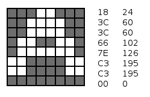

# Getting to Know Forth

In this chapter, you'll have an understanding of how one typically writes software in Forth for the Kestrel-3, *on* the Kestrel-3.  This chapter is not directly intended to teach you how to program the Kestrel-3; rather, it's an illustration of what it's like to write software in a native Forth environment.  Unlike most programming tutorials, I'm just going to dive right into a non-trivial application: a simple font editor that you can use to make custom character sets.

It's not terribly complicated as applications go; but, it will touch many of the facilities of the Kestrel-3 on different levels of abstraction, and will introduce everything from the most basic to some moderately advanced Forth programming idioms that you might not have thought possible from reading other chapters of this book.

The program is presented in a manner that allows you to type in the program step by step and to follow along.  It's perfectly OK if you don't get things the first time around; feel free to revisit this chapter again later.  As always, if you have questions which I'm not answering, or if you feel this chapter can be improved, feel free to open a Github issue at [https://github.com/kestrelcomputer/kestrel/issues](https://github.com/kestrelcomputer/kestrel/issues).

If you intend on following along, it's best if you insert a *blank* SD card into the Kestrel-3's SD card slot.  This way, you won't have to worry about following the instructions and risking ruining data on an existing SD card.  If you're running the emulator, you can "insert" a card simply by creating a file named `sdcard.sdc` in the same directory that you're running the emulator from.  On Ubuntu Linux, you can do this with the command `touch sdcard.sdc` *before* launching the emulator, like so:

    rm -f sdcard.sdc
    dd if=/dev/zero of=sdcard.sdc bs=1024 count=200
    bin/e romfile roms/forth

## Block Storage

You may be familiar with other programming environments in older home computers, such as their many dialects of BASIC, or you may be familiar with programming on today's enterprise-quality environments, using languages as sophisticated as C#, C++, Java, etc.  The one thing these languages all have in common is the concept of the *file*, an arbitrarily long sequence of secondary storage in which you store a program.

In these environments, you tend to enter your program using some kind of *editor*, typically as one or more modules, which you then save with a single action (e.g., selecting **Save** from a menu, or typing `SAVE "MY PROGRAM",8` or the like).  Today, even many dialects of Forth prefer this style of programming, since it lets the compiler take advantage of the tooling and filing systems available to the host operating system.

Since the Kestrel-3 currently lacks a file-capable operating system in its system ROM[^define_rom], an alternative method of storing Forth applications is required.  We do this using something called *block storage*.  Blocks are also known as *screens*, particularly when used to store Forth programs.

[^define_rom]: Read-Only Memory.  This is the kind of memory which the Kestrel-3 can rely on retaining its contents even when power is disconnected from the computer.

A single block stores exactly 1024 bytes, or 1 *kilobyte* of memory (in our case, to the mounted SD card).  They are identified by number, from 1 to however many may fit on your particular SD card.  The programmer typically maintains an awareness of which ranges of blocks are used by which programs or which data files.

I'm going to assume you have a fresh SD card inserted into the slot, or an empty `sdcard.sdc` file created for the Kestrel-3 emulator to work with.  To prepare to work on our font editor, let's type the following commands:

    100 CLEAN
    100 LIST

You should see Forth respond with `ok` after it finishes each command.  The first command tells Forth to reset block 100 to all spaces, preparing it to contain Forth source code.  The second lists the block just to make sure it has been cleared.  Your screen should look like this:

Let's provide this block with a title (useful for when we run `INDEX`, which I'll explain later), and a command to load another block.  Do not worry about how I chose this other block; honestly, it's arbitrary.  It also, at this point at least, doesn't matter that we haven't provided any source code for this other block yet, because we'll just `CLEAN` it later first.

    0 SET ( Chapter 2 Font Editor   saf2 2016apr17 )
    2 SET MARKER empty
    3 SET 110 LOAD

Now, if you type `100 LIST` again, you should see the program you entered so far.

## Zooming In on a Glyph

A font is, in its most basic form, a collection of glyphs.  Each glyph describes how the character it represents appears to the human viewer.  The Kestrel's system font consists of 256 fixed, eight-pixel by eight-pixel matrices of on or off bits.

You might have heard the term "byte" before, but never really understood what it meant on a concrete level.  A byte is simply eight bits.  A bit, then, is an on/off value, stored in numerical form as either a 1 or a 0.  This combination of bits allows us to represent numbers, text, etc.  The interpretation, really, is entirely context dependent.  This is important to us because of how we exploit this fact to render text on the screen.  Below, you'll find a blown-up example of what I mean.  It's the letter A itself, represented both in terms of on/off pixels, and the corresponding hexadecimal and decimal representation.

{id="ch2_img_glyphA"}

What we want our font editor to do, ultimately, is render a character in "fat bits", approximating the graph on the left-hand side above, where it's easier for us to see and later manipulate.  We don't really care about the corresponding hexadecimal or even their decimal values.  That's something for the computer to worry about.

### White Fat Bits

The most fundamental thing we have is "the bit."  It's either on (1) or off (0).  On bits render as white on the screen, so we're going to recreate that in the fat-bits magnification as well.  So, let's write a simple program to render a bit that is "on".  I'm going to zoom in by a factor of 16; meaning, each pixel in a character will now occupy a 16 pixel rectangle on the screen.  Since rectangles aren't fundamental objects, let's break this down even further.

Our rectangle will consist of 16 rows of 16 pixels.  As it happens, Kestrel Forth has a word `H!` which lets us set 16-bits of memory at a time (*half-word store*, in case you were wondering what `H!` stood for).  So, storing a number with all bits turned on into the video frame buffer should yield a small white line in the upper left-hand corner of the screen:

    -1 $FF0000 H!

After demonstrating our intuition is correct, we next want a program to repeat the above simple program enough times to draw a solid rectangle, without having to manually specify addresses everywhere.  Let's just specify the address once:

    PAGE
    $FF0000

and see if we can use the computer itself to remember the address for us.  While we're at it, let's make sure the computer in fact *does* remember our address after we're done:

    -1 OVER H! .S

Why `OVER`?  Because our address was placed on the Forth data stack first, and the value we want to write is underneath it, we need to "reach over" to access the address again for `H!` to work correctly.  The `.S` word will print to the display the current data stack contents without actually clearing the stack.

After proving this does the same thing, we have a number left on the stack -- that's our memory address.  We just need to increment it to the next row of pixels on the screen.  With the Kestrel-3 running at 640x480 resolution with only 2 colors on the screen (black and white), it turns out that each row of pixels corresponds to 80 bytes.  You can figure this out yourself by simply dividing the resolution by the number of pixels stored in a byte (640 / 8 = 80).  So, we use that figure to increment our address:

    -1 OVER H!  80 +  .S

The first time you type the above line, nothing will apparently have happened.  However, as you type that line several times in a row, you should be able to confirm that it actually works as intended.  A slim white rectangle will start to grow downwards in the upper-lefthand corner of the screen.

All that typing is getting laborious though, so let's tell Forth to remember what we mean whenever we say, just to pick an arbitrary name, *row*:

    : row ( a - a' )  -1 OVER H!  80 + ;

There are some more language elements to discuss here.  The `:` symbol tells Forth that we're interested in creating a new word.  The name of the word follows immediately; in this case `row`, as in row of pixels.

The stuff between the parentheses is a *comment*; its purpose is to inform the programmer of some relevant information about the word; it has zero effect on the meaning of the Forth program itself.  In this case, we're illustrating a "stack effect diagram," or more simply, "stack effect."  This is saying to whoever is reading the code, in a symbolic way, that we're accepting an address `a`, and returning another address `a'`.  It's not stated in this comment that `a' > a` or that `a' = a+80`, because it's obvious from context what the result should be.  Reading the line of source, we see that `a'` should be larger than `a` by 80.  Another reason who know this must be true is because of the context in which we intend on using `row`, namely to affect graphics on the screen.  We'll talk more about stack effects elsewhere.

`;` tells the compiler when to *stop* the compilation, and identifies the official end of the definition.

So now, you should be able to just type `row` several times and get the same effect.

When we've convinced ourselves that we can draw individual rows of pixels on the screen, let's bundle this into yet another word that draws a properly proportioned rectangle on the screen, and test it.  Note how we use `PAGE` to clear the screen; it also means we have to use `AT-XY` to place the cursor underneath where we expect the rectangle to go, so the `ok` prompt doesn't overwrite what we just drew.

    : on ( - ) $FF0000 15 FOR row NEXT DROP ; 
    PAGE 0 4 AT-XY
    on

Why only `15` in the program?  That's because `FOR` counts down towards, and including, zero.  If you were to count the numbers out sequentially, 15, 14, 13, 12, 11, 10, 9, 8, 7, 6, 5, 4, 3, 2, 1, and 0, you'll notice that there are in fact *16* numbers present.

You should see a big white rectangle in the upper-lefthand corner of the screen.  This proves to us that the code works as intended; of course, it's fixed to that corner, so we'll need to change this code later.  But, for now, let's commit this to block 110 before we lose it.

    110 CLEAN
    0 SET ( Fatbits rendering   saf2 2016apr17 )
    2 SET : row ( a - a' ) -1 OVER H! 80 + ;
    3 SET : on ( - ) $FF0000 15 FOR row NEXT DROP ;

To test what we have so far, we make sure that all buffers are actually saved to storage:

    FLUSH

and then we restart the Forth environment:

    BYE

At this point, we should have a clean slate.  Let's make sure our code works:

    100 LOAD
    on
    .S

We should, again, see a white rectangle in the upper-lefthand corner of the screen.  We should also see that our data stack is empty.

### Black Fat Bits

We turn our attention now to representing those bits which are turned *off*.  Referring back to [the figure of the glyph for the letter A](#ch2_img_glyphA), note how despite the dark squares imply dark dots on the screen, we can still see the grid lines in the figure.  We similarly want some kind of visual cue on the screen when representing fat bits for dark pixels.

What we need to do is render the edges of a simple rectangle, like so:

We already know how to get the horizontal line:

    PAGE 0 4 AT-XY
    -1 $FF0000 H!

But, how do we get the vertical strip?  We only need the top-most bit of the 16-bit row to be set, so let's give it a shot:

    $8000 $FF0050 H!

Whoops, that's not right.  If we were to continue with this, we'd end up with something that looks like a giant T.  The reason this happens is because the microprocessor in the Kestrel-3 is a *little-endian* processor, while the video circuitry expects data to be stored in *big-endian* format[^mgia_history].  For this reason, we need to swap the upper and lower halves of the word we want to store.  You can confirm this following code words:

    $0080 $FF0050 H!
    $0080 $FF00A0 H!

You should start to see the top-most portion of the rectangle's edges start to appear in the upper left-hand corner of the screen.

[^mgia_history]: The Monochrome Graphics Interface Adapter, or MGIA, core is responsible for taking data from memory and sending it to your monitor.  I originally developed it for the Kestrel-2, which originally was going to use a *word-addressed* processor.  Later in its evolution, it became more advantageous to switch the processor to use bytes as its smallest addressible unit; however, the MGIA remained word-addressed.  The Kestrel-3 inherits the Kestrel-2's MGIA (in the upgraded form of the MGIA-II) core, complete with its word-based addressing.  Fear not, however; the successor to the MGIA-II core will let you adjust its endianness, making writing software for it significantly less burdensome.
 
So, our black fat-bit consists of a row of pixels, followed by a 15-tall column of pixels.  Let's incorporate that definition into our program so far:

    110 LIST
    3 OPEN
    3 SET : col ( a - a' ) $0080 OVER H! 80 + ;
    5 SET : off ( - ) $FF0000 row 14 FOR col NEXT DROP ;
    FLUSH
    100 LOAD
    off .S

You should see something like the following:

### Rows of Fat Bits

At this point, we have a means of drawing a single white or black fat bit in the upper left-hand corner of the display.  But, what we'd really like is to draw a complete matrix of them.  A matrix is an array of arrays, of course, so it seems logical that our next step is to simply get an array of fat bits up on the screen first.

I need a plan to go about doing this.  I won't go into the different approaches I've considered here; this chapter is already quite long as it is.  Instead, I'll just invoke the power of successive refinement and iterative programming.

For the moment, let's pretend we have a version of `on` and `off` which renders a white or black fat-bit where we tell it.  That is, instead of hardcoding `$FF0000` as the frame buffer memory address, we accept this value from the stack.  It would be very convenient if we can invoke a sequence like, `on off on off`, to just render fat-bits horizontally.  Since `on` and `off` would accept an address from the stack, it follows that they *must* also leave an address on the stack as well.

In other words, we need `on` and `off` to have the following stack effects:

    : on ( a - a' ) ...
    : off ( a - a' ) ...

But what is `a'` in this case?  Since a byte holds 8 pixels, and our fat-bits are 16-pixels wide, it follows then that `a' = a + 2`.  Provided we don't do this more than 40 times in a row, we should be able to draw a horizontal strip of fat-bits.

The simplest way to achieve this is to change our existing definitions like so:

    110 LIST
    4 SET : on ( a - a') DUP 15 FOR row NEXT DROP 2 + ;
    5 SET : off ( a - a') DUP row 14 FOR col NEXT DROP 2 + ;
    110 LIST  ( to make sure our changes took )
    FLUSH

Now, we need to test them to make sure our assumptions hold.

    BYE
    100 LOAD
    $FF0000 on off on off HEX U. DECIMAL

You should see something like the following:

